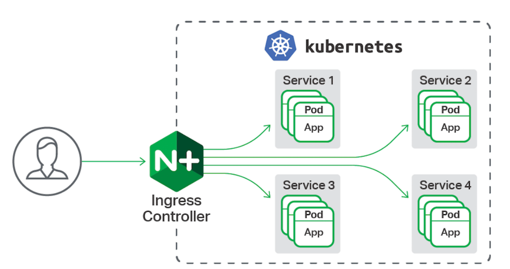

# Nginx Ingress Gateway

The `Ingress` is a Kubernets resource that allows to configure a HTTP Load Balancer for application running on Kubernetes, represented by one or more Services.



## Adding Nginx Ingress on Azure
---

- `Create a Namespace`
```bash
kubectl create namespace nginx-ingress
```

- `Deploy Nginx Ingress Controller on Azure`
```bash
helm repo add ingress-nginx https://kubernetes.github.io/ingress-nginx

helm install nginx-ingress ingress-nginx/ingress-nginx \
    --namespace nginx-ingress \
    --set controller.replicaCount=2 \ # <-- Number of Nginx Controller a good number for production is 3
    # Below Configurations is Azure Specifics
    --set controller.nodeSelector."beta\.kubernetes\.io/os"=linux \
    --set defaultBackend.nodeSelector."beta\.kubernetes\.io/os"=linux \
    --set controller.admissionWebhooks.patch.nodeSelector."beta\.kubernetes\.io/os"=linux
```
- `Getting Load Balancer Public Ip`
```bash
kubectl --namespace nginx-ingress get services -o wide -w nginx-ingress-ingress-nginx-controller

# NAME                                     TYPE           CLUSTER-IP    EXTERNAL-IP    PORT(S)                      AGE
# nginx-ingress-ingress-nginx-controller   LoadBalancer   10.0.20.186   40.76.165.44   80:32621/TCP,443:32640/TCP   2m18s
```

- `Testing the Nginx Ingress Gateway`

For now, there is any route configured, however it possible to make a request on the external-ip an check if nginx returns a 404 error.

```bash
curl http://40.76.165.44

# <html>
# <head><title>404 Not Found</title></head>
# <body>
# <center><h1>404 Not Found</h1></center>
# <hr><center>nginx</center>
# </body>
# </html>
```

- `Configure the Custom Domain Name`
Create a DNS A Record point to nginx-loadbalancer

|HOST |DNS RECORD | VALUE
:--- | :---: | ---
|aks.codefeeling.com.br|A|40.76.165.44

<br/>

- `Install Cert-Manager`

Cert-manager is a Kubernetes tool that issues certificates from various certificate providers, including Let’s Encrypt.

```bash
# Installs Resource Definitions
kubectl apply --validate=false -f https://raw.githubusercontent.com/jetstack/cert-manager/release-0.12/deploy/manifests/00-crds.yaml --namespace nginx-ingress

# Disable Validation
kubectl label namespace nginx-ingress certmanager.k8s.io/disable-validation=true

# Adds JetStack (CertManager Repository)
helm repo add jetstack https://charts.jetstack.io

# Installs Cert Manager
helm install cert-manager --namespace nginx-ingress --version v0.12.0 jetstack/cert-manager --set ingressShim.defaultIssuerName=letsencrypt --set ingressShim.defaultIssuerKind=ClusterIssuer
```

- `Deploy a Cluster Issue`

A Cluster Issue represents a certificate authority from which signed x509 certificates can be obtained, such as Let's Encrypt.

The Cluster Issue resource is a single issuer that can be consumed by multiple namespaces.

```yaml
apiVersion: cert-manager.io/v1alpha2
kind: ClusterIssuer
metadata:
  name: letsencrypt
spec:
  acme:
    server: https://acme-v02.api.letsencrypt.org/directory
    email: my-email@xpto.com # <-- Add your email here
    privateKeySecretRef:
      name: letsencrypt
    solvers:
      - http01:
          ingress:
            class: nginx

```

## Configuring Applications
---


Lets configure two applications to use Nginx Ingress Gateway.

- `App1`
```yaml
apiVersion: apps/v1
kind: Deployment
metadata:
  name: app1  
spec:
  replicas: 1
  selector:
    matchLabels:
      app: app1
  template:
    metadata:
      labels:
        app: app1
    spec:
      containers:
      - name: app1
        image: mcr.microsoft.com/azuredocs/aks-helloworld:v1
        ports:
        - containerPort: 80
        env:
        - name: TITLE
          value: "Welcome to Azure Kubernetes Service (AKS)"
---
apiVersion: v1
kind: Service
metadata:
  name: app1  
spec:
  type: ClusterIP
  ports:
  - port: 80
  selector:
    app: app1

```

- `App2`
```yaml
apiVersion: apps/v1
kind: Deployment
metadata:
  name: app2  
spec:
  replicas: 1
  selector:
    matchLabels:
      app: app2
  template:
    metadata:
      labels:
        app: app2
    spec:
      containers:
      - name: app2
        image: mcr.microsoft.com/azuredocs/aks-helloworld:v1
        ports:
        - containerPort: 80
        env:
        - name: TITLE
          value: "AKS Ingress Demo"
---
apiVersion: v1
kind: Service
metadata:
  name: app2  
spec:
  type: ClusterIP
  ports:
  - port: 80
  selector:
    app: app2

```

- `Creating Ingress Route`

The ingress route should be create on the same namespace where the service was created.

```yaml
# Ingress to App1
apiVersion: networking.k8s.io/v1
kind: Ingress
metadata:
  name: app1
  annotations:
    kubernetes.io/ingress.class: nginx # <-- Nginx Ingress Controller automatically detects this annotation
    nginx.ingress.kubernetes.io/ssl-redirect: "true" # <-- Redirects to HTTPS
    nginx.ingress.kubernetes.io/use-regex: "true" # <-- Allow to use Regex for Managing Routing 
    nginx.ingress.kubernetes.io/rewrite-target: /$1 #<-- Rewrites the request with the first capture group
    cert-manager.io/cluster-issuer: letsencrypt # <-- Name of the Cluster Issuer
spec:
  tls:
  - hosts:
    - aks.codefeeling.com.br
    secretName: app1-codefeeling-tls
  rules:
  - host: aks.codefeeling.com.br # <-- Add your custom domain here
    http:
      paths:
      # Matches:
      # /app1
      # /app1/
      # /app1/something(*)
      # Rewrites to : /app1/ or /app1
      - path: /app1(/|$)(.*)
        pathType: Prefix
        backend:
          service:
            name: app1 # <-- Redirects to service app1
            port:
              number: 80
      # Used to load frontend images
      # Ex: /static/acs.png
      - path: /(.*)
        pathType: Prefix
        backend:
          service:
            name: app1 # <-- Redirects to service app1
            port:
              number: 80
``` 

```yaml
# Ingress to App2
apiVersion: networking.k8s.io/v1
kind: Ingress
metadata:
  name: app2
  annotations:
    kubernetes.io/ingress.class: nginx # <-- Nginx Ingress Controller automatically detects this annotation
    nginx.ingress.kubernetes.io/ssl-redirect: "true"
    nginx.ingress.kubernetes.io/use-regex: "true" # <-- Allow to use Regex for Managing Routing 
    nginx.ingress.kubernetes.io/rewrite-target: /$1 #<-- Rewrites the request with the first capture group
    cert-manager.io/cluster-issuer: letsencrypt # <-- Name of the Cluster Issuer
spec:
  tls:
  - hosts:
    - aks.codefeeling.com.br
    secretName: app2-codefeeling-tls
  rules:
  - host: aks.codefeeling.com.br # <-- Add your custom domain here
    http:
      paths:
      # Matches:
      # /app2
      # /app2/
      # /app2/something(*)
      # Rewrites to : /app2/ or /app2
      - path: /app2(/|$)(.*)
        pathType: Prefix
        backend:
          service:
            name: app2 # <-- Redirects to service app2
            port:
              number: 80
      # Used to load frontend images
      # Ex: /static/acs.png
      - path: /(.*)
        pathType: Prefix
        backend:
          service:
            name: app2 # <-- Redirects to service app2
            port:
              number: 80
```

It is important to notice, that when there are `multiple matches` on a specific route the precedence will be given first to the longest matching path. If two paths are still equally matched, precedence will be given to paths with an exact path type over prefix path type.

## References
---

- [`Installing Nginx SSL on AKS`](https://docs.microsoft.com/en-us/azure/dev-spaces/how-to/ingress-https-nginx)

- [`Encrypting Certificate on Kubernetes`](https://medium.com/avmconsulting-blog/encrypting-the-certificate-for-kubernetes-lets-encrypt-805d2bf88b2a)

- [`Cert Manager`](https://cert-manager.io/docs/installation/kubernetes/) 
