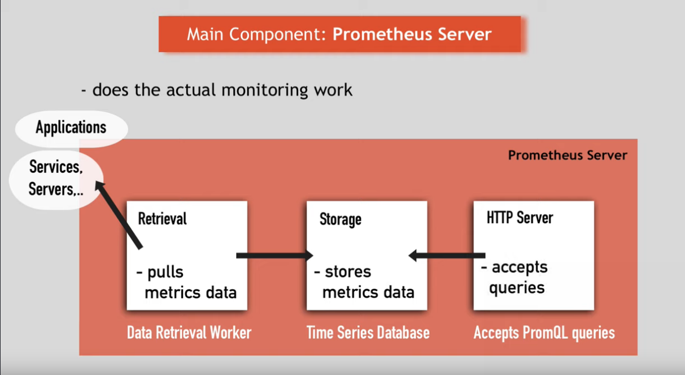
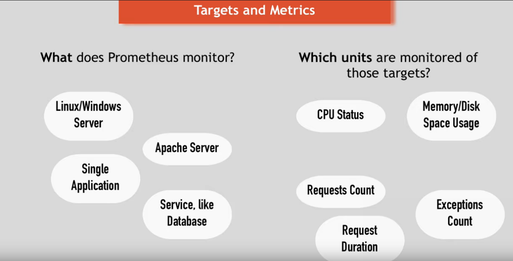
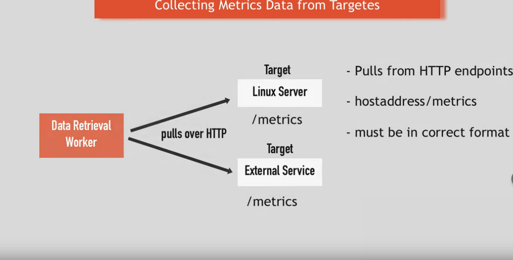
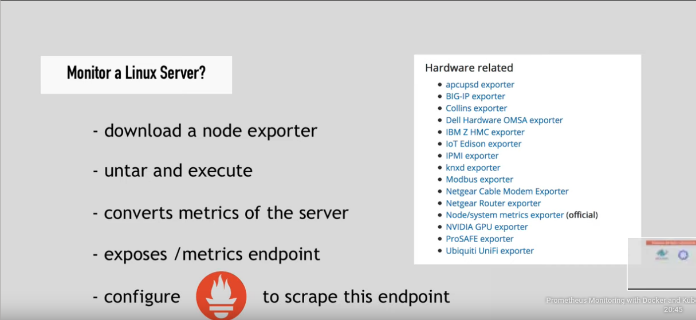
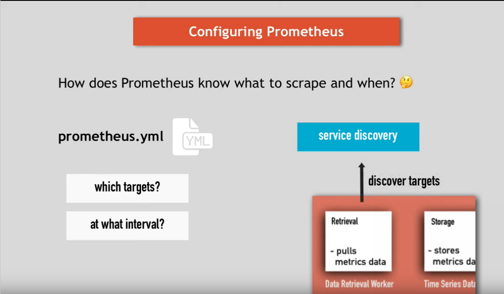
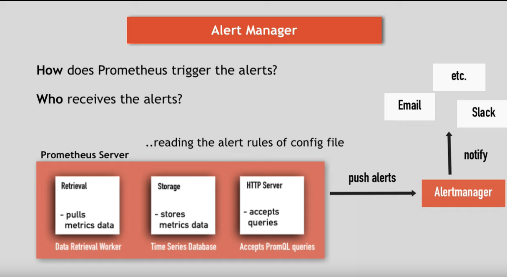
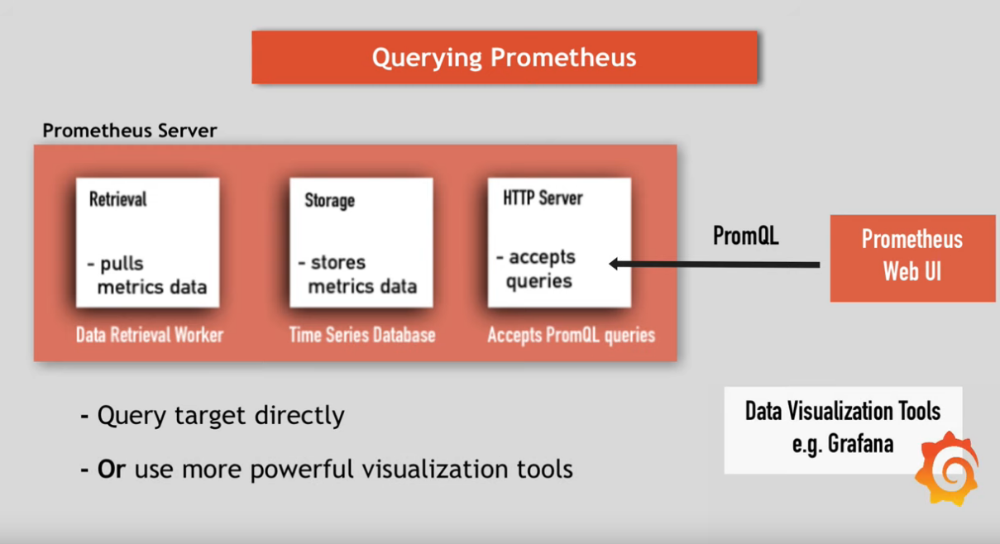

# Prometheus

Prometheus is the mainly tool used to monitoring highly dynamic container environments, such as: `Kubernetes` and `Swarm`.

## Installing Prometheus
---

```bash
# Creates Namespace
kubectl create ns monitoring

# Add Helm Repository
helm repo add prometheus-community https://prometheus-community.github.io/helm-charts
helm repo update

# Installing Prometheus Stack
helm install prometheus prometheus-community/kube-prometheus-stack -n monitoring

# Getting Prometheus Stack Pods
kubectl get pods -n monitoring

# NAME                                                     READY   STATUS    RESTARTS   AGE
# alertmanager-prometheus-kube-prometheus-alertmanager-0   2/2     Running   0          42s
# prometheus-grafana-6549f869b5-c55rr                      2/2     Running   0          52s
# prometheus-kube-prometheus-operator-f5d67844f-dbp4t      1/1     Running   0          52s
# prometheus-kube-state-metrics-685b975bb7-spjss           1/1     Running   0          52s
# prometheus-prometheus-kube-prometheus-prometheus-0       2/2     Running   1          42s
# prometheus-prometheus-node-exporter-tdw44                1/1     Running   0          53s
# prometheus-prometheus-node-exporter-z56bl                1/1     Running   0          53s
``` 

## Monitoring Third-Party Resources

Prometheus also can monitoring third party resources like: mysql, mongodb, kafka e much more.

However, an extra set of steps is required:

- `Deploying MondoDB`

```bash
kubectl apply -f mongodb.yaml
```

- `Configuring Export - Overwrite Values`

It will be used this [helm](https://github.com/prometheus-community/helm-charts/tree/main/charts/prometheus-mongodb-exporter) deploy to configure the mongoDB Export. 

And for that it is necessary to add labels on the Service Monitoring and also configure the mongoDB service where the metrics will be scraped

```yaml
mongodb:
  # <protocol>://<service-name>:<service-port>
  uri: "mongodb://mongodb-service:27017" # <-- Mongo DB endpoint in the cluster
  
serviceMonitor:
  additionalLabels:
    release: prometheus # <-- Custom Label to allow prometheus to discover this Service Monitor
```

- `Installing the MongoDB Export`
```bash

# Adding Repository
helm repo add prometheus-community https://prometheus-community.github.io/helm-charts
helm repo update

helm install mongodb-exporter prometheus-community/prometheus-mongodb-exporter \
  -f ./prometheus-mongo-exporter-values.yaml
```

## Prometheus Architecture
---



- `Storage` - Stores Metrics Data

- `Retrievel` - Pulls data from application, Services, Server etc

- `HTTP Server` - Allows Queries (Prometheus UI / Grafana)

## Prometheus Concepts
---

There are several concepts inside the prometheus architecture



- `Target` - What does Prometheus Monitor ? (Application, Linux/Windos Server, Database, Services etc)

- `Unit` - What is monitored in the Target ? (CPU, Memory, Disk Space Usage, Request Count, Expections Count)

- `Metrics` - Value of an unit in a specific target that is stored on Prometheus Storage. Metrics are stored on Human-Readable Text Based:

  - HELP Attributes: Description of what the metrics is
  - TYPE Attributes: 3 Metrics Type [ Counter | Gauge | Histogram ] 

## Collecting Data
---

Prometheus collects data making http request to a target. The target must contain the path `/metrics` that exposes its data on a format that prometheus understand.



When a target does not expose its metrics on the default prometheus path `/metrics`. It is necessary another resource called `Exporter` to monitoring this target.



For example, on a Kubernets Cluster it is possible to deploy a MySQL Container with a MySQL Export as a sidecar and exposes the database metrics as a format that prometheus undestand and can monitore.

## Service Monitor
---

Service Monitor is a prometheus custom resource used by prometheus to find new services to scrape (`Service Discover`)

By default prometheus scrape all `Service Monitors` that has the label `release: prometheus`.

This way, prometheus knows that there is a new  Service Monitor and new endpoints where metrics can be scraped for there.

## Configuring Prometheus
---

All configurations of prometheus is deployed in an unique file called `prometheus.yml`. In this file is defined which targets should be monitored and how often. After that, prometheus uses a `service discovery` to find the targets.



```yaml
global:
  scrape_interval: 15s # How often Prometheus will scrape its targets
  evaluation_interval: 15s # How often Prometheus will evaluate the rules on `rules_files` section

rule_files: # Aggregates metric values or creates alerts when condition met
  - "frist.rules"
  - "second.rules"

scrape_configs: # What resources Prometheus will monitor
  - job_name: prometheus
    static_configs:
      # Prometheus has its own /metrics endpoint
      - targets: ['localhost:9090'] # localhost:9090/metrics
  - job_name: node_exporter
    scrape_interval: 1m
    scrape_timeout: 1m
    static_configs:
      - targets: ['localhost:9091']

```

## Alert Manager
---

Prometheus uses a resource called `Alert Manager` to emit an alert when a specific condiction (rule) defined in the config file is reached.

The Alert Manager can send notification through: Email, Slack, Webhooks and much more.



## Querying Prometheus
---

Once prometheus data is stored, it is possible to query it using prometheus UI (PromQL) or more powerfull tools like grafana.




## References

- [`Prometheus Concepts Tutorial`](https://www.youtube.com/watch?v=h4Sl21AKiDg&t=0s)

- [`Prometheus Stack Tutorial`](https://www.youtube.com/watch?v=QoDqxm7ybLc)

- [`Prometheus Monitoring Third Party Apps`](https://www.youtube.com/watch?v=mLPg49b33sA&t=0s&ab_channel=TechWorldwithNana)

- [`Prometheus Exporters`](https://prometheus.io/docs/instrumenting/exporters/)

- [`Prometheus Exporters Helm`](https://github.com/prometheus-community/helm-charts/tree/main/charts)